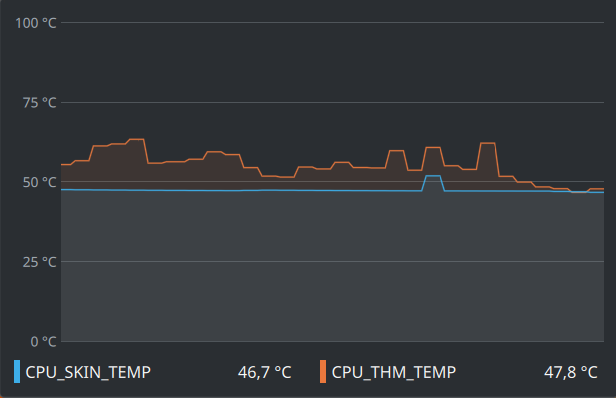

### Description
The plugin reads values from files and displays these values as sensors in Plasma System Monitor (KSysGuard) or
plasmoids.



### Installation
Download `ksystemstats_plugin.so` from the release page and copy it to `/usr/lib/qt6/plugins/ksystemstats/`.

### Build and install from source
```bash
# Step 1. Install the "cmake" and "extra-cmake-modules" packages:
sudo pacman -S cmake extra-cmake-modules 

# Step 2. Clone this repository and customize the code if needed:
git clone https://github.com/vazh2100/ksystemstats_custom_sensors.git

# Step 3. Create a "build" directory inside the repository and navigate to it:
mkdir build && cd build 

# Step 4. Prepare, build, and install the plugin:
cmake -DCMAKE_BUILD_TYPE=Release .. && cmake --build . && sudo cmake --install . 
```

### Default usage
Create a script or service that writes sensor values to the following files:  
`/tmp/custom_sensor_1.txt`  
`/tmp/custom_sensor_2.txt`

For example, I use this plugin to get the processor's skin temperature and core temperature from the `ryzenadj`
program.  
This is my `runit` service. The `tmp` directory is mounted as `tmpfs` (RAM memory):
```bash
while true; do
    /usr/bin/ryzenadj -i | awk -F'|' '
#     NR == 7  && /STAPM LIMIT/     { print $3+0 > "/tmp/STAPM_LIMIT"; next }
#     NR == 8  && /STAPM VALUE/     { print $3+0 > "/tmp/STAMP_VALUE"; next }
#     NR == 9  && /PPT LIMIT FAST/  { print $3+0 > "/tmp/FAST_LIMIT";  next }
#     NR == 10 && /PPT VALUE FAST/  { print $3+0 > "/tmp/FAST_VALUE";  next }
#     NR == 11 && /PPT LIMIT SLOW/  { print $3+0 > "/tmp/SLOW_LIMIT";  next }
#     NR == 12 && /PPT VALUE SLOW/  { print $3+0 > "/tmp/SLOW_VALUE";  next }
    NR == 26 && /THM VALUE CORE/  { print $3+0 > "/tmp/CPU_THM";     next }
    NR == 28 && /STT VALUE APU/   { print $3+0 > "/tmp/CPU_SKIN";    next }
    '
    sleep 5
done
```

### Customization
###### You can add or remove sensors in `~/.config/customsensorrc`:
```
[Sensor]
id=custom_sensor_1 #unique id
name=CPU Skin #name of sensor
file=/tmp/custom_sensor_1.txt #file where the sensor reads value
unit=UnitCelsius #measure unit
[Sensor]
id=custom_sensor_2
name=CPU THM
file=/tmp/custom_sensor_2.txt
unit=UnitCelsius
```

###### `Unit` possible values:
```
    // Byte size units.
    UnitByte
    UnitKiloByte
    UnitMegaByte
    UnitGigaByte
    UnitTeraByte
    UnitPetaByte
    
    // Data rate units.
    UnitByteRate
    UnitKiloByteRate
    UnitMegaByteRate
    UnitGigaByteRate
    UnitTeraByteRate
    UnitPetaByteRate

    // Frequency.
    UnitHertz
    UnitKiloHertz
    UnitMegaHertz
    UnitGigaHertz
    UnitTeraHertz
    UnitPetaHertz

    // Time units.
    UnitBootTimestamp
    UnitSecond
    UnitTime
    UnitTicks
    UnitDuration

    // Data rate units in bits.
    UnitBitRate
    UnitKiloBitRate
    UnitMegaBitRate
    UnitGigaBitRate
    UnitTeraBitRate
    UnitPetaBitRate

    // Volt.
    UnitVolt
    UnitKiloVolt
    UnitMegaVolt
    UnitGigaVolt
    UnitTeraVolt
    UnitPetaVolt

    // Watt.
    UnitWatt
    UnitKiloWatt
    UnitMegaWatt
    UnitGigaWatt
    UnitTeraWatt
    UnitPetaWatt

    // WattHour.
    UnitWattHour
    UnitKiloWattHour
    UnitMegaWattHour
    UnitGigaWattHour
    UnitTeraWattHour
    UnitPetaWattHour

    // Ampere.
    UnitAmpere
    UnitKiloAmpere
    UnitMegaAmpere
    UnitGigaAmpere
    UnitTeraAmpere
    UnitPetaAmpere

    // Misc units.
    UnitCelsius
    UnitDecibelMilliWatts
    UnitPercent
    UnitRate
    UnitRpm
```
